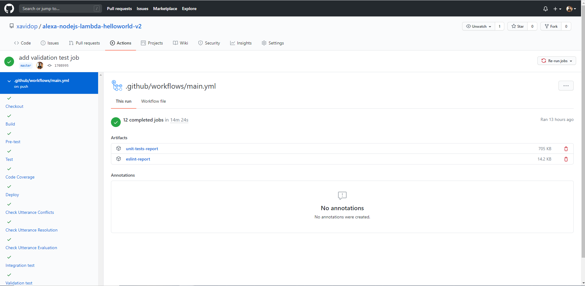

[](https://codecov.io/gh/xavidop/alexa-nodejs-lambda-helloworld-v2)

# DevOps your Skill

<!-- TOC -->

- [DevOps your Skill](#devops-your-skill)
  - [Prerequisites](#prerequisites)
  - [Pipeline](#pipeline)
    - [Checkout](#checkout)
    - [Build](#build)
    - [Pretests](#pretests)
    - [Test](#test)
    - [Code Coverage](#code-coverage)
    - [Deploy](#deploy)
    - [Testing the Voice User Interface](#testing-the-voice-user-interface)
    - [Integration tests](#integration-tests)
    - [End to end tests](#end-to-end-tests)
    - [Validation tests](#validation-tests)
    - [Submit](#submit)
    - [Store-artifacts](#store-artifacts)
  - [Workflow](#workflow)
  - [GitHub Action](#github-action)
  - [Resources](#resources)
  - [Conclusion](#conclusion)

<!-- /TOC -->

"DevOps is the union of people, process, and products to enable continuous delivery of value to our end users." - Donovan Brown, Microsoft

DevOps is a "culture" which have a set of practices that combines software development (Dev) and information-technology operations (Ops) which aims to shorten the systems development life cycle and provide continuous delivery with high software quality. DevOps culture develops "production-first mindset". 
In terms of Alexa, DevOps can help us to quickly ship the highest quality of our Skill to the end customers.
This post contains materials from different resources that can be seen on Resources section.

## Prerequisites

Here you have the technologies used in this project
1. Amazon Developer Account - [How to get it](http://developer.amazon.com/)
2. AWS Account - [Sign up here for free](https://aws.amazon.com/)
3. ASK CLI - [Install and configure ASK CLI](https://developer.amazon.com/es-ES/docs/alexa/smapi/quick-start-alexa-skills-kit-command-line-interface.html)
4. GitHub Account -  [Sign up here](https://github.com/)
5. Visual Studio Code

The Alexa Skills Kit Command Line Interface (ASK CLI) is a tool for you to manage your Alexa skills and related resources, such as AWS Lambda functions.
With ASK CLI, you have access to the Skill Management API, which allows you to manage Alexa skills programmatically from the command line.
If you want how to create your Skill with the ASK CLI, please follow the first step explained in my [Node.js Skill sample](https://github.com/xavidop/alexa-nodejs-lambda-helloworld). 
We are going to use this powerful tool to do some steps in our pipeline. Let's DevOps!


## Pipeline



Let's explain job by job what is happening in our powerful pipeline. 
First of all, each box on the left represented in the image above is a job and they will be defined below the `jobs` node in the GitHub Actions Workflow configuration file:

### Checkout

The checkout job will execute the following tasks:
1. Checkout the code 
2. Bring execution permission to be able to execute all the tests

```yaml
  checkout:
    runs-on: ubuntu-latest
    name: Checkout
    steps:
      # To use this repository's private action,
      # you must check out the repository
      - name: Checkout
        uses: actions/checkout@v2
      - run: |
          chmod +x -R ./test;
          ls -la
```

### Build

The build job will execute the following tasks:
1. Checkout the code.
2. Run `npm install` in order to download all the Node.js dependencies, including dev dependencies.

```yaml
  build:
    runs-on: ubuntu-latest
    name: Build
    needs: checkout
    steps:
      # To use this repository's private action,
      # you must check out the repository
    - name: Checkout
      uses: actions/checkout@v2
    - run: |
        cd lambda;
        npm install

```

### Pretests

The pretest job will execute the static code quality check. Check the full explanation [here](docs/ESLINT.md).

### Test

The test job will execute the unit tests. Check the full explanation [here](docs/UNITTESTS.md).

### Code Coverage

The codecov job will execute the code coverage report. Check the full explanation [here](docs/CODECOV.md).

### Deploy

The deploy job will deploy the Alexa Skill to the Alexa cloud in the development stage. Check the full explanation [here](docs/DEPLOY.md).

### Testing the Voice User Interface

These jobs will check our interaction model. Check the full explanation [here](docs/VUITESTS.md).

### Integration tests

These jobs will check the interaction model and our backend as well. Check the full explanation [here](docs/INTEGRATIONTESTS.md).

### End to end tests

These jobs will check the full system using the voice as input. Check the full explanation [here](docs/ENDTOENDTESTS.md).

### Validation tests

These jobs will validate your Alexa Skill before submitting it to certification. Check the full explanation [here](docs/VALIDATIONTESTS.md).

### Submit

These jobs will submit your Alexa Skill to certification. Check the full explanation [here](docs/SUBMIT.md).

### Store-artifacts

The store-artifacts job will execute the following tasks:
1. Restore the code that we have used in the previous step in `/home/node/project` folder
2. Clean `node_modules` folder
3. Store the entire code of our Alexa Skill as an artifact. It will be accessible in GitHub Actions whenever we want to check it out.

```yaml

  store-artifacts:
    runs-on: ubuntu-latest
    name: Submit
    needs: submit
    steps:
    # To use this repository's private action,
    # you must check out the repository
    - name: Checkout
      uses: actions/checkout@v2}
    - name: Upload code
      uses: actions/upload-artifact@v2
      with:
        name: code
        path: ${{ github.workspace }}

```

## Workflow

The GitHub Actions Workflow which will execute the jobs explained above configuration file is located in `.github/workflows/main.yml`.

## GitHub Action

Before explain the pipeline, it is important to explain the GitHub Action which are using the Docker image that you can use in your pipelines. 
You can find all the explanation in [this repo](https://github.com/xavidop/alexa-ask-aws-cli-docker).

## Resources
* [DevOps Wikipedia](https://en.wikipedia.org/wiki/DevOps) - Wikipedia reference
* [Official Alexa Skills Kit Node.js SDK](https://www.npmjs.com/package/ask-sdk) - The Official Node.js SDK Documentation
* [Official Alexa Skills Kit Documentation](https://developer.amazon.com/docs/ask-overviews/build-skills-with-the-alexa-skills-kit.html) - Official Alexa Skills Kit Documentation
* [Official GitHub Actions Documentation](https://docs.github.com/) - Official GitHub Actions Documentation

## Conclusion 

This is the first step to know how to DevOps your Alexa Skills using GitHub Actions.
As you have seen in this example, the Alexa Tools like ASK CLI can help us a lot. We will update this readme while we are updating the pipeline.
I hope this example project is useful to you.

That's all folks!

Happy coding!
